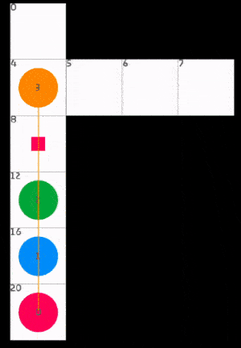

# py-lacam

[](./LICENCE.txt)
[](https://github.com/Kei18/py-lacam/actions/workflows/ci.yml)

A minimal Python implementation of LaCAM* (lazy constraints addition search) for Multi-Agent Path Finding (MAPF).

## Description

LaCAM* is a graph pathfinding algorithm to solve MAPF. With the effective use of other MAPF algorithms, such as [PIBT](https://kei18.github.io/pibt2/), LaCAM can achieve remarkable scalability (e.g., for 10k agents), while maintaining nice theoretical guarantees.

- Okumura, K. LaCAM: Search-Based Algorithm for Quick Multi-Agent Pathfinding. AAAI. 2023. [[project-page]](https://kei18.github.io/lacam)
- Okumura, K. Improving LaCAM for Scalable Eventually Optimal Multi-Agent Pathfinding. IJCAI. 2023. [[project-page]](https://kei18.github.io/lacam2)
- Okumura, K. Engineering LaCAM*: Towards Real-Time, Large-Scale, and Near-Optimal Multi-Agent Pathfinding. AAMAS. 2024. [[project-page]](https://kei18.github.io/lacam3)

The original references use PIBT as a submodule, which makes the implementation a bit complicated.
Here, I provide a much simpler implementation by replacing PIBT with __random action selection__.
While __this is not at all effective from a performance perspective__, it can highlight the simple (and beautiful imo) structure of the algorithm and also can help understand the underlying concept.

Feel free to use/extend this repo!

## News

- 13 Jan. 2024: A  simple implementation of LaCAM with PIBT is now available. It is scalable. Check this [branch](https://github.com/Kei18/py-lacam/tree/pibt).

## Setup

This repository is based on [Poetry](https://python-poetry.org/).
After cloning this repo, run the following to complete the setup.

```sh
poetry config virtualenvs.in-project true && poetry install
```

## Demo

```sh
poetry run python app.py -m assets/tunnel.map -i assets/tunnel.scen -N 4 --time_limit_ms 5000 --verbose 2
```

The result will be saved in `output.txt`.
The grid maps and scenarios follow the format of [MAPF benchmarks](https://movingai.com/benchmarks/mapf/index.html).


### Visualization

You can visualize the planning result with [@Kei18/mapf-visualizer](https://github.com/kei18/mapf-visualizer).

```sh
mapf-visualizer ./assets/tunnel.map ./output.txt
```



### without refienment

When you need just a suboptimal solution, try:

```sh
poetry run python app.py -m assets/tunnel.map -i assets/tunnel.scen -N 2 --no-flg_star
```

### Jupyter Lab

Jupyter Lab is also available.
Use the following command:

```sh
poetry run jupyter lab
```

You can see an example in `notebooks/demo.ipynb`.

## Licence

This software is released under the MIT License, see [LICENSE.txt](LICENCE.txt).


## Notes

- There is [a minimal Python implementation for PIBT](https://github.com/Kei18/pypibt) as well.
