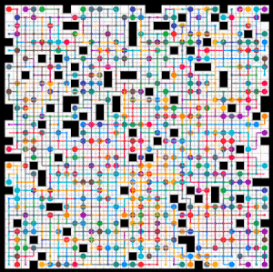

# py-lacam-pibt

The main branch provides the simplest implementation of LaCAM(\*) with __random action selection__.
Instead, this branch provides a simple implementation of LaCAM* with a vanilla __[PIBT](https://kei18.github.io/pibt2/)__, like the [AAAI-23](https://kei18.github.io/lacam) paper.
Now it is scalable.
See the main branch for more details.

Note that this implementation still omits many useful techniques as seen in the [IJCAI-23](https://kei18.github.io/lacam2) or [AAMAS-24](https://kei18.github.io/lacam3/) papers.

## Example

```sh
poetry run python app.py -m assets/random-32-32-10.map -i assets/random-32-32-10-random-1.scen -N 400 --no-flg_star
```



_540ms on my Mac Book Pro (M2 Max)_
